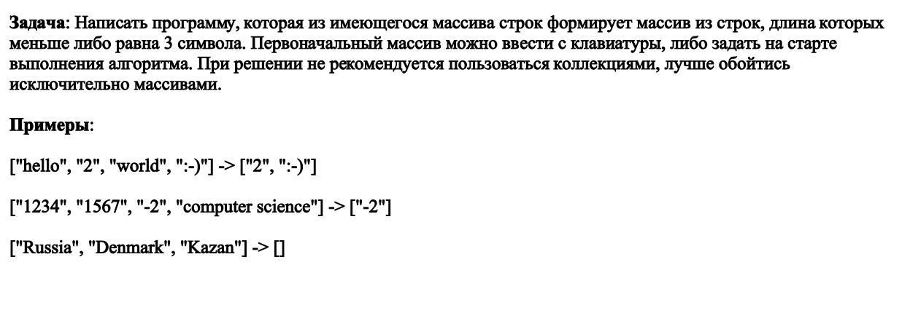
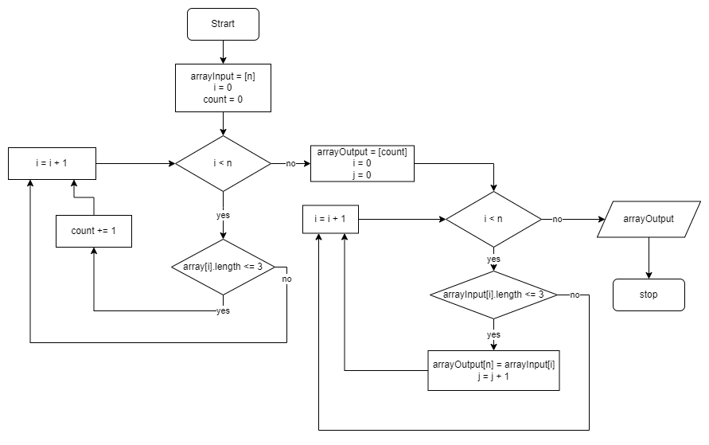

#  Описание решения итогового задания #

***Условие:***

**Вариант решения:**

1. Создаем массив заполненный текстовыми элементами (arrayInput)
2. Проходим циклом по массиву и считаем количество элементов длина которых меньше или равна 3. Полученные данные записываются в переменную count.
3. Создаем новый массив (arrayOutput) с количеством элементов равным count. 
4. Снова проходим циклом по массиву arrayInput и каждый элемент длина которого меньше или равна 3 записываем в результирующий массив arrayOutput. Перебор элементов массива arrayOutput осуществляется за счет добавления переменной j, которая меняется каждый раз когда соблюдается условие по длине.
5. Выводим массив arrayOutput на экран.

**Блок-схема**

**На основе полученного алгоритма составляем программу:**
//Создадим функцию
void GetArray()
    {
    string[] arrayInput = new string[5];
    Console.WriteLine("Введите элементы массива");
    //Кол-во элементов с длиной <= 3 сохраним в count
    int count = 0; 
    for (int i = 0; i < arrayInput.Length; i++)
        {
            Console.Write($"{i}-й элемент: ");
            arrayInput[i] = Console.ReadLine();
            if (arrayInput[i].Length <= 3 && arrayInput[i] != "") count++;
        }  
    Console.Write("Получен массив: ");
    Console.WriteLine("[{0}]", string.Join(", ", arrayInput));

    //Заполняем новый массив и выводим в консоль
    string[] arrayOutput = new string[count];
    int n = 0;
    for (int i = 0; i < arrayInput.Length; i++)
        {
            if (arrayInput[i].Length <= 3 && arrayInput[i] != "")
            {
                arrayOutput[n] = arrayInput[i];
                n++;
            } 
        }
    Console.Write("Сформирован новый массив: ");    
    Console.WriteLine("[{0}]", string.Join(", ", arrayOutput));   
    }

GetArray();
